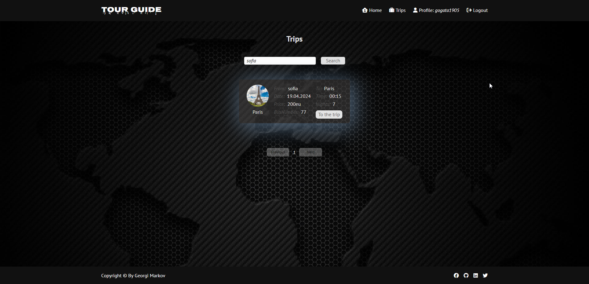
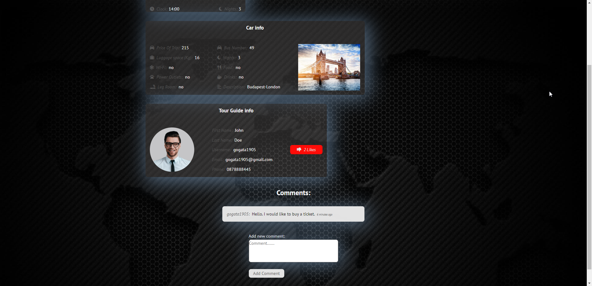
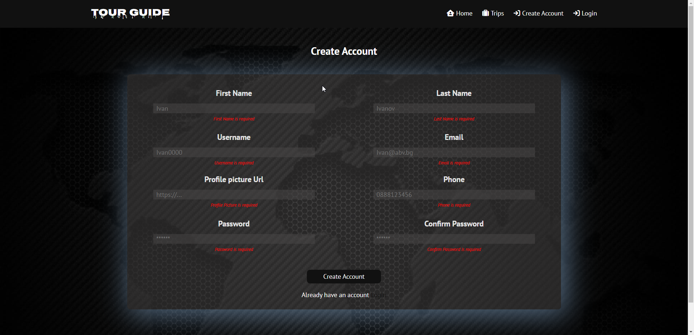

# TourGuide
SoftUni React June 2024 Project Defense

## Introduction
TourGuide is application for Tour Guide travels between countries. You can create a Trip and others can join.

## Features
The main feature of the application is fully working CRUD operations with image files.

- Home page - displays the last three trips from the database.
- Trips page - Catalogue that displays all Trips from the database in separate pages.
- Login/Register - shows Register and Login forms.
- Search bar - shows search input to find all matches in the database by trip name.
- Add Trip - Logged in users can upload url picture and create trip.
- Profile page: Displays the User info with edit and delete account option
- Edit Profile - Logged in users can edit their profile information.
- Trip Details page: Shows detailed information, all comments about the trip and other people's account likes.
- Logged in users can like accounts, post comments,edit own comments,delete own comments 
- The creator of the trip can post comments, edit the trip info and delete the trip.
- 404 page - Animated page, that pops up when there is no matching route.

## How to use?
- 0.1.Download the repository and extract it to folder
- 0.2.Create folder "uploads" in the server folder because its auto getting deleted by github

 
  
- 1.Setup Server:
- 1.1.Open terminal in "server" folder with Visual Studio Code
- 1.2.In Terminal type: npm i 
(if there are old packages update them by updating package.json,removing package-lock,removing node_modules and npm i command again )
- 1.3.In Terminal to start the Server type: npm start

 
  
- 2.Setup Client:
- 2.1.Open terminal "client" folder with Visual Studio Code
- 2.2.In Terminal type: npm i 
(if there are old packages update them by updating package.json,removing package-lock,removing node_modules and npm i command again )
- 2.3.In Terminal to start the client type: npm run dev
- 2.4.Open: http://localhost:5173/
- 2.5.Enjoy

## Used libraries:
    - `nodemon` - automatically restarts the server during development.
    - `bcrypt`, `cookie-parser`, `jsonwebtoken` - for authentication and authorization.
    - `moment` for date manipulation.
    - `mongoose` - for easily working with mongoDB.
    - `react-slick`,`slick-carousel` - for slides

## Database

MongoDB with Mongoose is used for storing & managing the data.

## Demo
Live demo at Replit  - https://replit.com/@GeorgiMarkov/TourGuide-React-Project-001?v=1
Live demo at Youtube - https://youtu.be/ry2zJRCZipk

## Photos

Recently Added Posts in Home page:

 

Search page:

 

All Posts page with pagination:

 

Comments on Post:

 

Likes on Post:

 

Register page:

 

Error 404:

 

Add Post page:

 

Edit Post page:

 

Edit User Info page:

 

Delete Post With Confirmation:

 

Details:

 

Edit Comment:

Delete Comment:

Delete Account:

